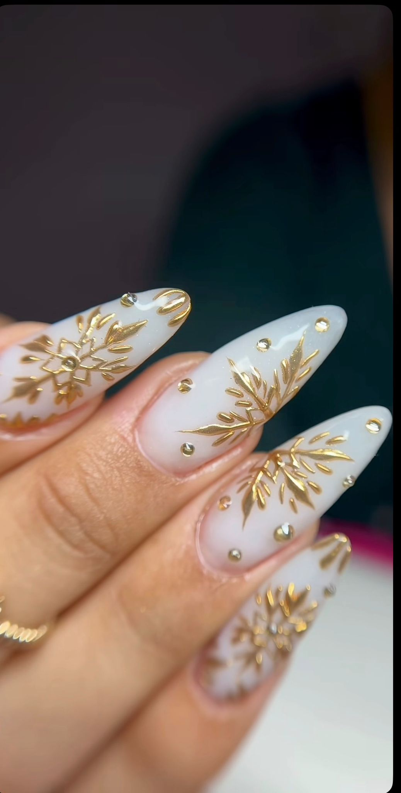

# 💅 IVA Nail Art - Luxury Nail Studio Website

A beautiful, modern website for IVA Nail Art studio in Brooklyn, NY. Built with Next.js 16, featuring a bilingual booking system and elegant design.



## 🌟 Features

- ✨ **Luxury Design** - Elegant color scheme and smooth animations
- 🌍 **Bilingual** - Full support for English and Spanish
- 📱 **Fully Responsive** - Perfect on mobile, tablet, and desktop
- 📅 **WhatsApp Booking** - Integrated appointment booking system
- 🎨 **Service Catalog** - Complete pricing and service information
- 🖼️ **Gallery** - Showcase of beautiful nail art work
- 🚀 **Lightning Fast** - Optimized with Next.js and Vercel
- ♿ **Accessible** - Built with accessibility in mind

## 🔗 Live Site

**Production:** [https://iva-nail-art.vercel.app](https://iva-nail-art.vercel.app)

## 🛠️ Tech Stack

- **Framework:** [Next.js 16.1.1](https://nextjs.org/)
- **Styling:** [Tailwind CSS 4](https://tailwindcss.com/)
- **Icons:** [Lucide React](https://lucide.dev/)
- **Language:** TypeScript
- **Deployment:** [Vercel](https://vercel.com/)

## 📁 Project Structure

```
iva-nail-art/
├── app/
│   ├── constants/
│   │   ├── data.ts           # Services, prices, config
│   │   ├── translations.ts   # English/Spanish text
│   │   ├── index.ts          # Barrel exports
│   │   └── README.md         # Data documentation
│   ├── page.tsx              # Main landing page
│   ├── layout.tsx            # Root layout
│   ├── loading.tsx           # Loading state
│   ├── not-found.tsx         # 404 page
│   └── globals.css           # Global styles
├── public/
│   ├── portada.jpg           # Hero image
│   ├── trabajo1.jpg          # Gallery image 1
│   ├── trabajo2.jpg          # Gallery image 2
│   └── trabajo3.jpg          # Gallery image 3
└── README.md                 # This file
```

## 🎨 Customization Guide

### Update Prices

Edit `app/constants/data.ts`:

```typescript
{
  id: "gel-mani",
  name: "Gel Manicure",
  price: 55,  // ← Change price here
  duration: "45 min",
  category: "manicure"
}
```

### Change Business Info

Edit the `CONFIG` object in `app/constants/data.ts`:

```typescript
export const CONFIG = {
  businessName: "IVA Nail Art",
  phone: "+1 (929) 625-7273",
  location: "Brooklyn, NY 11209",
  hours: "9:00 AM – 8:00 PM",
  // ... more settings
};
```

### Update Translations

Edit `app/constants/translations.ts` for English or Spanish text.

### Add New Services

Add to the `SERVICES` array in `app/constants/data.ts`:

```typescript
{
  id: "new-service",
  name: "Service Name",
  nameEs: "Nombre del Servicio",
  description: "Description",
  descriptionEs: "Descripción",
  price: 50,
  duration: "1 hr",
  category: "manicure",
  popular: false
}
```

## 🚀 Development

### Prerequisites

- Node.js 18+ installed
- npm or pnpm

### Install Dependencies

```bash
npm install
```

### Run Development Server

```bash
npm run dev
```

Open [http://localhost:3000](http://localhost:3000) in your browser.

### Build for Production

```bash
npm run build
```

### Start Production Server

```bash
npm start
```

## 📦 Deployment

This project is configured for automatic deployment on Vercel:

1. Push changes to GitHub
2. Vercel automatically detects and deploys
3. Live in ~2 minutes

### Manual Deployment

```bash
git add .
git commit -m "Your changes"
git push origin main
```

## 🎯 Key Features Explained

### Bilingual Support

Switch between English and Spanish with a single click. All content, including service descriptions and booking flow, is fully translated.

### WhatsApp Integration

The booking system generates a pre-filled WhatsApp message with:
- Selected service
- Date and time
- Customer information
- Pricing details

### Responsive Design

Mobile-first design that adapts perfectly to:
- 📱 Phones (320px+)
- 📱 Tablets (768px+)
- 💻 Desktops (1024px+)

### Performance Optimized

- ⚡ Next.js Image optimization
- 🎨 Tailwind CSS JIT compilation
- 📦 Code splitting
- 🔄 Automatic static optimization

## 📞 Contact Information

**IVA Nail Art**
- 📍 Brooklyn, NY 11209
- 📱 +1 (929) 625-7273
- 📸 [@iva_nailart_ny](https://instagram.com/iva_nailart_ny)

## 📝 License

Copyright © 2025 IVA Nail Art. All rights reserved.

---

Built with 💅 by Claude Code
